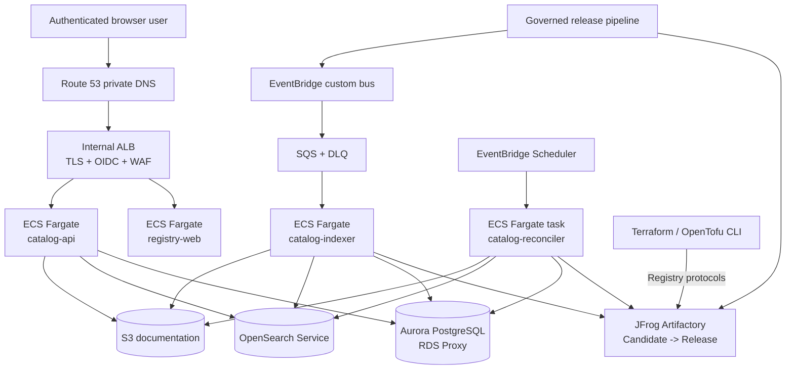

# Private Terraform/OpenTofu Registry Blueprint

This repository is the canonical implementation blueprint for a large-enterprise private Terraform/OpenTofu registry experience built with:

- **JFrog Artifactory** as the authoritative package registry and download data plane.
- **The OpenTofu Registry UI frontend** as the existing user-interface foundation.
- **AWS managed services** as the catalog, documentation, search, eventing, security, and operational control plane.
- **Amazon ECS on AWS Fargate** for all application workloads.
- **Terraform** for AWS infrastructure provisioning.

The installation path and the human discovery path are intentionally separate:

```text
Terraform/OpenTofu CLI  ------------------> JFrog Artifactory
Browser                 ------------------> AWS UI and catalog API
Release pipeline        --> JFrog --> EventBridge/SQS --> catalog indexer
```

A catalog outage must not prevent `terraform init` or `tofu init`. JFrog remains the package authority; the AWS catalog is rebuildable.

## Run the starter locally

The runnable starter is the Java 25 Spring Boot API with PostgreSQL and OpenSearch:

```bash
cd repositories/private-registry-api
docker compose up --build --wait
curl http://localhost:8080/health/ready
curl 'http://localhost:8080/registry/docs/search?q=vpc'
```

Flyway creates the catalog schema and loads deterministic fixture records only under the Compose `local` profile. See the API repository README for build, test, shutdown, and data-reset commands.

## Two production repositories

The deployable product is split into exactly two repositories:

1. **`private-registry-ui`**
   - Controlled frontend-only fork of the OpenTofu Registry UI.
   - Enterprise-neutral branding, runtime configuration, governance panels, and JFrog usage snippets.
   - Static assets served by Nginx in ECS Fargate.
   - Browser calls only the catalog API.

2. **`private-registry-api`**
   - Java 25 Spring Boot catalog API and Flyway migrations.
   - OpenTofu UI compatibility API plus enterprise extensions.
   - Terraform for the complete AWS runtime.
   - Database migrations, event contracts, OpenSearch templates, CI/CD, runbooks, and operational controls.

Because one GitHub repository was supplied for this planning deliverable, both repository roots are captured here as exportable templates:

```text
repositories/private-registry-ui/
repositories/private-registry-api/
```

Export them with:

```bash
./scripts/export-repositories.sh ./exported
```

## Start here

1. [`DEPLOYMENT.md`](DEPLOYMENT.md) — end-to-end deployment sequence.
2. [`CLAUDE.md`](CLAUDE.md) — exact implementation-agent contract.
3. [`docs/00-implementation-plan.md`](docs/00-implementation-plan.md) — full plan and work breakdown.
4. [`docs/01-architecture.md`](docs/01-architecture.md) — layered target architecture.
5. [`docs/02-repository-model.md`](docs/02-repository-model.md) — two-repository boundaries and project trees.
6. [`docs/03-aws-services.md`](docs/03-aws-services.md) — complete AWS resource inventory.
7. [`docs/10-terraform.md`](docs/10-terraform.md) — Terraform layout and deployment order.
8. [`docs/16-required-inputs.md`](docs/16-required-inputs.md) — values that must be supplied before deployment.
9. [`docs/18-status.md`](docs/18-status.md) — what is scaffolded versus what still requires implementation.

## Architecture at a glance



## Design rules

- JFrog is authoritative for package bytes and package existence.
- Aurora is authoritative for catalog, ownership, lifecycle, and approval metadata.
- OpenSearch is a derived index and must be rebuildable.
- S3 stores normalized versioned documentation and immutable evidence.
- The browser never receives JFrog or AWS service credentials.
- Public provider identities remain unchanged and are mirrored rather than republished.
- Internal provider releases are signed and verified.
- Released versions are immutable.
- Production is multi-AZ; disaster recovery is active/passive across Regions.
- The implementation is organization-neutral and contains placeholders rather than internal names.

## Validate the blueprint

```bash
./scripts/validate-blueprint.sh
```

See [`PROJECT_TREE.md`](PROJECT_TREE.md) for the complete captured file layout. The local API stack is executable and tested. The broader AWS ingestion, reconciliation, and disaster-recovery platform remains roadmap work; the status document and acceptance criteria define those remaining items.
