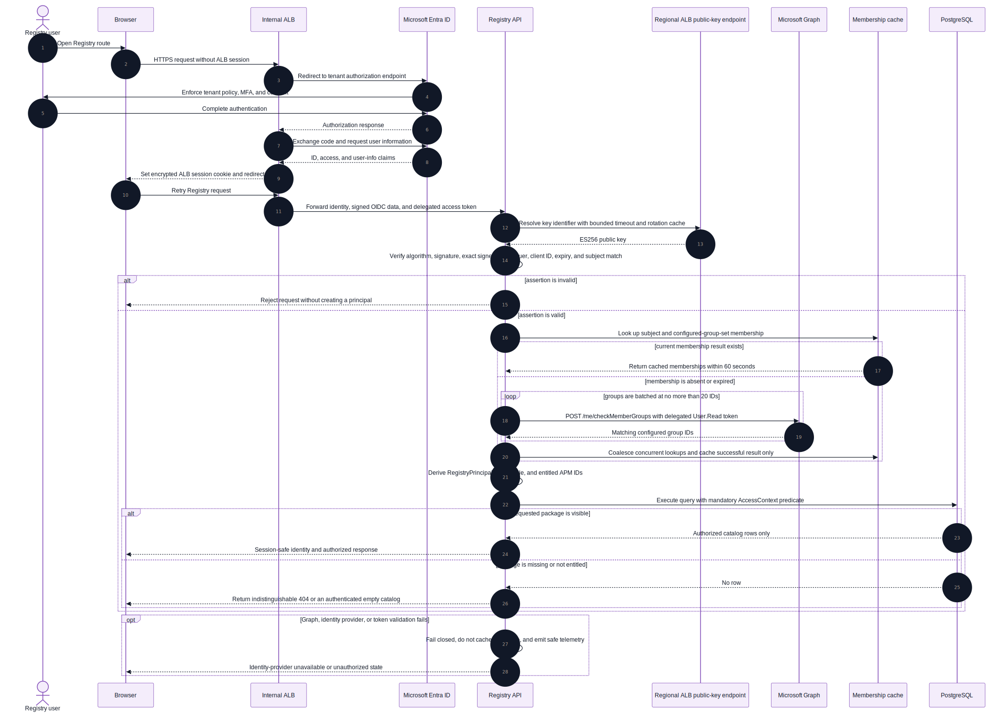
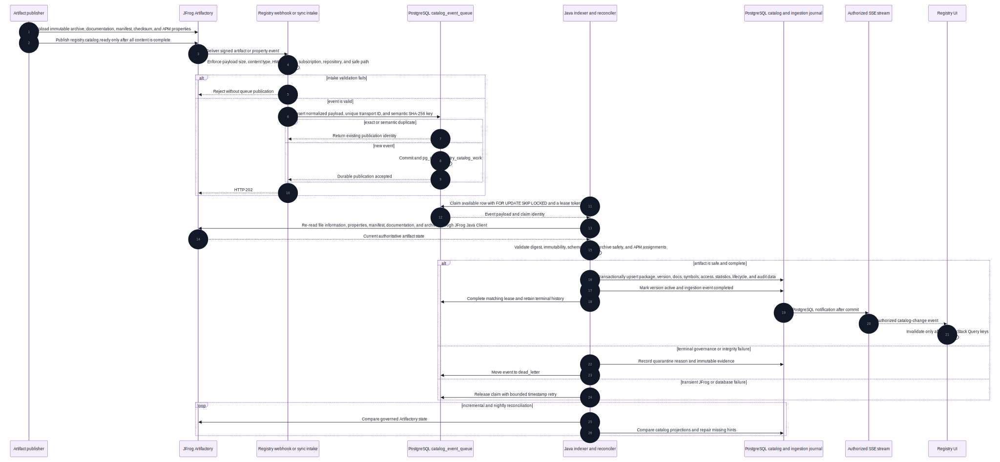

# Enterprise architecture diagrams

These diagrams turn the deployment handoff into reviewable system, security, data,
delivery, and operations views. The Mermaid `.mmd` source and extracted SVG/PNG files are
kept together under [`diagrams/`](diagrams/README.md). The sources are authoritative; the
images are portable review artifacts.

## 1. Enterprise system context

Use this view to establish trust boundaries, ownership, deployable processes, and
authoritative data stores.

## 2. Corrected AWS production topology

This is the production target only after every mandatory issue in the deployment-readiness
audit is closed. It does not assert that the current application-service Terraform is safe
to apply.

## 3. OIDC and APM authorization sequence

This view captures the security-critical assertion validation, delegated Graph membership
resolution, successful-result caching, server-side APM filtering, and fail-closed paths.

## 4. Artifact publication and ingestion sequence

This view shows why the webhook is a reconciliation hint rather than artifact truth:
workers always re-read current JFrog state through the official Java client before
transactional activation in PostgreSQL.

## 5. Catalog and authorization data model

This relationship view shows normalized package identities, immutable versions,
documentation, Terraform symbols, ownership, APM entitlements, categories, featured
content, lifecycle, approvals, and download snapshots.

## 6. Operations data model

This view separates singleton presentation settings, hashed automation credentials,
privacy-minimized authenticated traffic, audit history, the durable PostgreSQL work queue,
ingestion evidence, quarantine, checkpoints, and reconciliation runs.

## 7. Release and deployment pipeline

The release flow preserves separation between code-quality proof, immutable image creation,
infrastructure foundation, database/catalog activation, identity and browser acceptance,
and controlled promotion.

## 8. Local Docker Compose topology

Local acceptance intentionally uses real Entra, Graph, and destination JFrog integrations.
Only PostgreSQL is application state; the migration, role-bootstrap, and seeder containers
are one-shot jobs.

## 9. Observability, incident response, and recovery

This view connects actionable signals to containment, boundary-specific recovery, full
reconciliation, acceptance testing, stabilization, and post-incident correction.

## Maintenance rule

Never edit an extracted SVG or PNG by hand. Update the matching `.mmd`, run
`node scripts/render-mermaid-diagrams.mjs`, inspect both output formats, then run
`python scripts/validate_diagram_artifacts.py`. Keep the diagram set aligned with the
implemented migrations, security filters, deployment environment templates, and
readiness audit.
